# Go2 RL — apprendre à un robot quadrupède, de zéro, sur un GPU grand public

> 🇬🇧 *This project trains a Unitree Go2 quadruped with PPO in the
> [Genesis](https://github.com/Genesis-Embodied-AI/Genesis) simulator on a consumer AMD
> GPU (ROCm — no CUDA, no Isaac Gym): walking from scratch, then running, postures, LiDAR
> obstacle avoidance and rough terrain, with motor limits and domain randomization matched
> to the real robot's specs (sim-to-real). Documentation is in French — the GIFs, learning
> curves and code speak for themselves.*

Entraînement par renforcement d'un **Unitree Go2** (robot nu, **sans bras ni caméra**)
dans le simulateur **[Genesis](https://github.com/Genesis-Embodied-AI/Genesis)**, sur un
**GPU AMD Radeon RX 9070 (ROCm)**. Objectif : produire une vidéo pédagogique qui montre
le robot **apprendre plusieurs compétences au fil des checkpoints** — de la gigote
initiale à la marche, la course, se coucher/relever, s'asseoir, éviter des obstacles
au LiDAR, etc. — avec, en parallèle, **la courbe d'apprentissage qui monte** et une
**équivalence « temps GPU réel ↔ mois d'expérience-robot »**.

**🎬 Aperçu** — le Go2 apprend à marcher (robot à gauche, *durée avant chute* à droite qui
grimpe au fil de l'entraînement) :

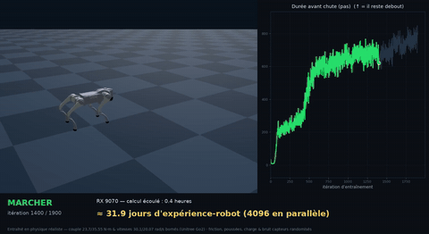

> Aperçu animé (extrait à vitesse réelle). Un **GIF par compétence** est disponible dans
> [`gifs/`](gifs/). Les **vidéos** haute résolution ET les **checkpoints** (`videos/`, `logs/`)
> ne sont **pas versionnés** (volumineux, ignorés par git) : sur un clone, on les recrée en
> **entraînant** (le code est fourni) **puis** en rendant avec `pilot_walk_video.py`
> (voir [Utilisation](#utilisation)).

---

## Sommaire

- [Pourquoi ce projet](#pourquoi-ce-projet)
- [Matériel & pile logicielle](#matériel--pile-logicielle)
- [Démarche](#démarche)
- [Fidélité au robot réel (sim → réel)](#fidélité-au-robot-réel-sim--réel)
- [Les compétences (segments de la vidéo)](#les-compétences-segments-de-la-vidéo)
- [Détail de chaque étape](#détail-de-chaque-étape-pour-néophytes)
- [Enseignements](#enseignements-findings)
- [Structure du dépôt](#structure-du-dépôt)
- [Installer la simulation](#installer-la-simulation-guide-débutant--1-commande)
- [Utilisation](#utilisation)
- [Pistes d'exploration](#pistes-dexploration-au-delà-de-ppo-à-récompense-façonnée)
- [Licence](#licence)

---

## Pourquoi ce projet

Montrer, de façon lisible pour un public non spécialiste, **à quoi ressemble
concrètement le RL sur du vrai matériel** :

- on part de **zéro** (poids aléatoires) — le robot ne sait rien faire ;
- on entraîne **4096 robots en parallèle** dans le simulateur ;
- on **sauvegarde des checkpoints réguliers** pour rejouer la progression ;
- on **rend une vidéo** où l'on voit, côte à côte, le comportement qui s'améliore
  **et** la métrique d'apprentissage qui progresse.

---

## Matériel & pile logicielle

| Élément | Détail |
|---|---|
| GPU | AMD Radeon **RX 9070** (backend **ROCm**, `gs.amdgpu`) |
| Simulateur | **Genesis** 1.2.x |
| Algo RL | **PPO** via [`rsl-rl-lib`](https://github.com/leggedrobotics/rsl_rl) (≥ 5.0) |
| Robots parallèles | **4096** environnements |
| Robot | Unitree **Go2**, URDF nu `urdf/go2/urdf/go2.urdf` (12 DOF, ni bras ni caméra) |
| Rendu / entraînement | entraînement **GPU** ; rendu des vidéos **CPU** — jamais les deux en même temps (voir note ci-dessous) |

---

## Démarche

1. **Entraînement d'une compétence** — le **pilote « marcher » de zéro** (*from-scratch*),
   puis les compétences suivantes en **warm-start** depuis lui (pour gagner du temps) —
   en sauvant un checkpoint toutes les 25 itérations (`save_interval`).
2. **Extraction de la métrique d'apprentissage** depuis les journaux TensorBoard
   (`Train/mean_reward` = récompense moyenne par épisode — l'indicateur le plus parlant :
   il **monte** quand le robot apprend ; `Train/mean_episode_length` = temps avant de
   tomber, très intuitif en locomotion).
3. **Rendu d'une vidéo composite** : à gauche le robot **au checkpoint courant**
   (galère → titube → marche), à droite **la courbe qui se remplit** au même rythme,
   et en bandeau **l'équivalence temporelle**.

### Pourquoi la courbe de récompense, et pas « la loss » ?

En apprentissage par renforcement (PPO), la *loss* n'est pas monotone et ne raconte pas
« il apprend ». La **récompense moyenne cumulée qui augmente** est l'indicateur canonique
et directement lisible.

### Équivalence « temps GPU ↔ expérience-robot »

Chaque itération fait vivre 4096 robots pendant 24 pas de contrôle à 50 Hz :

```
expérience par itération = 4096 envs × 24 pas × 0,02 s ≈ 1 966 s ≈ 32,8 min d'expérience-robot
```

Soit, pour les 2500 itérations de la marche, **≈ 57 jours** d'expérience continue d'un
robot réel, compressés en ~50 minutes de calcul sur la RX 9070. La vidéo affiche ce
ratio en direct (temps GPU écoulé ↔ mois/années équivalents).

> ⚠️ **Note pratique (AMD/ROCm)** : ne jamais lancer un rendu/éval Genesis CPU pendant
> qu'un entraînement GPU tourne — sérialiser les deux (ici : crash GPU constaté sinon).

---

## Fidélité au robot réel (sim → réel)

L'objectif n'est pas un robot « de jeu » : chaque contrainte physique est calée sur le
**vrai Unitree Go2** pour qu'une policy entraînée ici ait un sens sur le matériel.

### Specs constructeur (moteur Unitree GO-M8010-6)

| Grandeur | Hanche / Cuisse | Genou |
|---|---|---|
| Couple nominal | **23,7 N·m** | **35,55 N·m** |
| Vitesse max | **30,1 rad/s** | **20,07 rad/s** |

Couple crête annoncé ~45 N·m (plus gros joint) — **c'est le nominal 23,7/35,55 N·m qui
est effectivement borné à l'entraînement**, pas la crête. Débattements : hanche ±60°,
cuisse −90…200° (avant) / −30…260° (arrière), genou −156…−48°. *(Valeurs de l'URDF officiel + fiches Unitree.)*

### Ce que la simulation impose

- **Couple borné** à ces valeurs (`enforce_motor_limits`) : le contrôleur ne peut pas
  demander un couple qu'un vrai servo ne fournirait pas.
- **Vitesses articulaires** maintenues dans les specs via une pénalité (`dof_vel_limit`).
- **Consignes de position clippées aux débattements URDF** (`clamp_targets_to_limits`,
  audit du 21/07) : le firmware du vrai Go2 refuse toute consigne hors plage
  articulaire — la sim reproduit ce clip par construction. Sans lui, le réseau peut
  « s'appuyer » sur des cibles inatteignables (couple de butée artificiellement
  constant), un comportement qui ne transfère pas au matériel.
- **Gains PD** kp = 20 / kd = 0,5 (valeurs standard de locomotion Go2).

### Randomisation de domaine (pour transférer au réel)

Le robot apprend **sous perturbations**, pas dans un monde parfait :

- **Friction sol** tirée aléatoirement **0,4–1,6** à chaque épisode (carrelage humide →
  béton adhérent) ;
- **Poussées** horizontales aléatoires (~toutes les 4 s, jusqu'à 1 m/s, phase propre à
  chaque robot) — bousculades ;
- **Charge dorsale** randomisée **0–0,5 kg** (accessoires embarqués) ;
- **Bruit de capteurs** : les observations passent par un bruit type IMU/encodeurs
  (gyro ±0,2 rad/s, attitude ±0,05, positions ±0,01 rad, vitesses ±1,5 rad/s) — le
  vrai robot ne « sent » jamais parfaitement son état.

Ces contraintes sont centralisées dans **`realism.py`** et injectées par
`apply_realism(env_cfg, reward_cfg)` — appelé dans `get_cfgs()`, donc **tout**
entraînement du projet en hérite **par construction** (pas juste par convention).
Toute nouvelle compétence doit appeler `apply_realism`.

Sources specs : [Unitree Go2](https://www.unitree.com/go2/) ·
[fiche moteur / teardown](https://www.simplexitypd.com/blog/unitree-go2-motor-teardown/) ·
[QUADRUPED Docs](https://www.docs.quadruped.de/projects/go2/html/Overview_1.html).

---

## Les compétences (segments de la vidéo)

| # | Compétence | Base | Statut |
|---|---|---|---|
| 1 | 🚶 Marcher | `go2_train.py` (from-scratch) | ✅ entraîné + rendu |
| 2 | 🏃 Courir | warm-start marche, curriculum vitesse | ✅ **2,7 m/s stable** (sprint 5 m/s abandonné : stabilité > vitesse) |
| 3 | 🛌 Se coucher | `go2_liedown_train.py` | ✅ entraîné + rendu |
| 4 | 🧎 Se relever | `go2_getup_env.py` | ✅ entraîné + rendu (anti-rebond `vertical_settle`, cf. *Enseignements*) |
| 5 | 🐕‍🦺 S'asseoir | `go2_sit_env.py` (gravité projetée) | ✅ entraîné — assiette *coarse+fine* + appuis rangés (`front_tuck`/`rear_tuck`) + descente progressive (v6), cf. *Enseignements* |
| 6 | 📡 Éviter au LiDAR (rayons visibles) | nav hiérarchique sur locomotion gelée | ✅ ré-entraîné enrichi (bruit de scan, passage étroit, piétons imprévisibles) — 3 scènes rendues + finale traversée/arrêt |
| 7 | 🧗 Franchir des obstacles | **7 familles de terrain séparées** | ✅ 7 familles entraînées + rendues (escalier, pyramide, pente, accidenté, rebords, trous, vagues) |

**Approche retenue** : d'abord **un pilote complet** (compétence « marcher » de bout en bout
— entraînement + courbe + overlay temps) pour valider le style visuel, puis on déroule
les autres compétences.

### Fichiers vidéo (segments à vitesse réelle)

> Les rendus vidéo (`videos/`) et les checkpoints (`logs/`) **ne sont pas versionnés**
> (volumineux, ignorés par git) ; seuls les **aperçus GIF** ([`gifs/`](gifs/)) sont dans le
> dépôt. Chaque segment ci-dessous se recrée en **entraînant puis en rendant** avec
> `pilot_walk_video.py` / `lidar_render.py` (cf. [Utilisation](#utilisation)) :

| Compétence | Rendu par | Nom de fichier généré |
|---|---|---|
| 🚶 Marcher | `pilot_walk_video.py -e go2-walking` | `segment_go2-walking.mp4` |
| 🏃 Courir | `pilot_walk_video.py -e go2-run` | `segment_go2-run.mp4` |
| 🛌 Se coucher | `pilot_walk_video.py -e go2-liedown` | `segment_go2-liedown.mp4` |
| 🧎 Se relever | `pilot_walk_video.py -e go2-getup` | `segment_go2-getup.mp4` |
| 🐕‍🦺 S'asseoir | `pilot_walk_video.py -e go2-sit` | `segment_go2-sit.mp4` |
| 📡 Éviter au LiDAR | `lidar_render.py --scenario fixes\|pietons\|goulot\|complet` | `segment_go2-lidar_*.mp4` |
| 🧗 Franchir des obstacles | `pilot_walk_video.py -e go2-terrain-<famille>` | `segment_go2-terrain-*.mp4` |

---

## Détail de chaque étape (pour néophytes)

> **Comment lire un « entraînement »** — On ne programme PAS le robot pas à pas. On lui
> donne une **récompense** (un score) qui décrit *ce qu'on veut*, et l'algorithme (PPO)
> ajuste tout seul, par essais-erreurs sur **4096 robots en parallèle**, la façon de
> bouger qui maximise ce score. Ci-dessous, chaque étape = un score différent.

### 1. 🚶 Marcher — *le pilote* ✅ *(entraîné)*


2500 itérations, ~0,8 h de calcul RX 9070
(≈ 57 jours d'expérience-robot), récompense qui grimpe de −0,9 à ~8, épisodes qui
tiennent ~870/1000 pas (le robot ne tombe presque plus).

**Ce qu'il apprend** : partir de mouvements aléatoires (il s'effondre) et découvrir une
démarche stable, **bien droite**, dans la direction demandée ; puis **s'immobiliser net**
quand on ne lui demande plus rien (pattes figées, posture droite).

**Comment on l'entraîne** — on additionne des récompenses simples :
- **avancer à la bonne vitesse** (récompense principale) ;
- **rester droit** : tronc à plat (`orientation`), corps haut sur ses pattes
  (`base_height`, cible 0,38 m), pattes verticales sous lui (`hip_straight`) ;
- **s'arrêter proprement** : à commande nulle, base immobile (`stand_still`) **et**
  pattes qui ne bougent plus (`dof_freeze_stop`) — 15 % des essais se font « à l'arrêt »
  pour qu'il apprenne aussi à *ne rien faire* ;
- **pénalités douces** contre les gestes brusques et les sauts verticaux.

C'est la seule étape entraînée **de zéro** ; les suivantes repartent souvent d'elle
(*warm-start*) pour gagner du temps.

### 2. 🏃 Courir

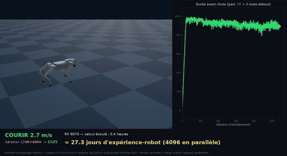

**Apprend** (2,7 m/s stable) : accélérer bien au-delà de la marche, tout en restant stable.

**Entraînement** : on repart du marcheur et on **augmente progressivement la vitesse
demandée** (curriculum) ; à grande vitesse on **relâche** les contraintes de posture
droite (un galop doit s'abaisser et engager les hanches), mais on **garde la
stabilité** (tronc à plat, ne pas tomber) et l'arrêt maîtrisé.

**Choix de vitesse : 2,7 m/s (stabilité > vitesse).** On a testé de pousser vers les
**~5 m/s** annoncés par Unitree (test labo du Go2 EDU) : sous nos couples moteur
bornés, la stabilité s'effondre (longueur d'épisode 940 → 250, chutes fréquentes).
On retient donc **2,7 m/s**, la vitesse la plus élevée où le robot court vite **et**
tient (~940 pas sans tomber). La spec labo est un plafond théorique, pas une cible
d'entraînement quand la priorité est de ne pas chuter (voir *Enseignements*).

**Arrêt maîtrisé après le sprint (finetune dédié).** Couper d'un coup 2,7 m/s → 0
faisait faire un **salto avant** au robot (l'inertie le bascule) : la *transition*
galop→immobilisation est trop rare pendant l'entraînement de la course pour être
maîtrisée. On ajoute une phase de finetune où **30 %** des essais reçoivent la
commande nulle (au lieu de 12 %), pour muscler spécifiquement la décélération stable
(voir *Enseignements*, « entraîner la transition, pas seulement le régime »).

### 3. 🛌 Se coucher

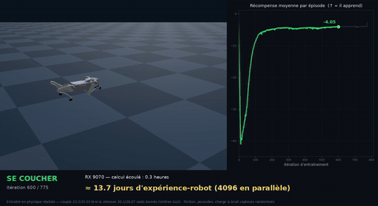

**Apprend** : descendre le corps au sol **lentement et de façon
contrôlée**, puis y rester stable. **Entraînement** : cible de hauteur basse
(0,12 m) + **forte pénalité de vitesse verticale du corps** — la cible tire vers le
bas, le frein de vitesse impose une descente graduelle type firmware. Deux versions
ont échoué avant celle-ci : la cible basse seule produisait un couchage **instantané**
(flop), et une cible-**trajectoire** temporelle (descente scriptée en étapes) n'était
**pas apprenable** — PPO restait debout, coincé dans l'optimum local (voir
*Enseignements*, « poser le mouvement dans la récompense »).

### 4. 🧎 Se relever

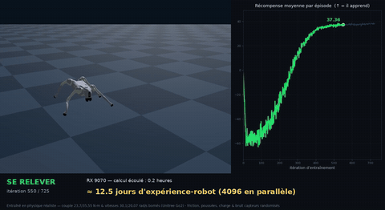

**Apprend** : depuis une position couchée/tombée (orientation
aléatoire : flanc, dos…), se remettre debout **proprement**. **Entraînement** : forte
récompense pour se redresser (gravité projetée) et reprendre la hauteur debout ;
l'immobilité n'est exigée **qu'une fois debout** (conditionnée à l'état mesuré, pas au
temps) — pendant la remontée, le robot a besoin de gestes amples et rapides, les
brider empêche le lever. Une pénalité **douce** des vitesses articulaires évite le
« battage de pattes » sans interdire la poussée.

### 5. 🐕‍🦺 S'asseoir

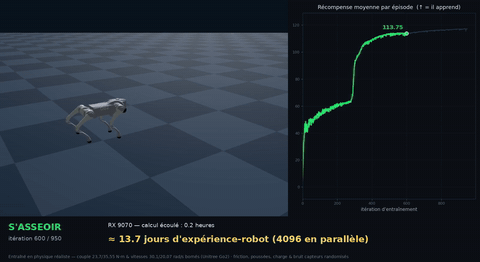

**Apprend** : l'arrière au sol, l'avant relevé (~40°, posture
« assis »), atteinte **lentement** : cibles statiques d'assiette (par gravité
projetée) et de hauteur d'arrière-train + **pénalité de vitesse verticale** qui
interdit de claquer la posture d'un coup (même recette que le coucher, après le
même double échec instantané/trajectoire). Pas de terme `orientation` : il forcerait
le tronc à plat — l'exact inverse de l'assise. **Troisième correctif (23/07)** : élargir
la gaussienne de cabrage avait débloqué le démarrage (il ne restait plus debout) mais
produisait un **étalement à mi-cabrage** (l'avant reste bas) — le demi-assis était déjà
« assez payant ». Passage à une gaussienne **coarse+fine** (large pour amorcer, étroite
pour récompenser fortement l'aboutissement) + poids relevé, pour forcer le cabrage
**complet** (voir *Enseignements*, « une gaussienne trop large plafonne à mi-geste »).
**Quatrième correctif (23/07, v3 puis v4)** : la *coarse+fine* relevait bien le poitrail
(nez-haut + train-bas, récompense ~48) mais le robot se calait sur des **appuis étalés** →
un assis **penché/avachi**. Cause : *aucun terme ne contrôlait la position des pieds*, seuls
l'assiette et la hauteur d'arrière-train étaient visés. Un premier terme **`front_tuck`**
(pieds **avant** rangés sous les épaules) n'a **quasi rien changé** (v3 ≈ v2) : en zoomant sur
le rendu, le vrai défaut était **derrière** — les **pattes arrière** s'étendent vers l'avant
au lieu de se replier sous la croupe. Correctif v4 : terme **`rear_tuck`** ciblant les pieds
**arrière** (distance pied ↔ attache de hanche, car la distance au centre ne discrimine pas
l'arrière — cf. *Enseignements*, « vérifier quelle partie du corps échoue » et « la bonne
métrique dépend du segment »). Le tout **sans** relâcher aucune physique — couples/vitesses
Unitree, débattements URDF, auto-collisions et contacts restent enforce.
**Cinquième correctif (23/07, v5)** : la descente restait un peu **trop instantanée**. On
**renforce la pénalité de vitesse verticale** (`lin_vel_z` −10 → −16, plus fort que le
coucher −12 car la cible d'assise est plus haute donc atteinte plus vite) : le robot
**s'abaisse plus progressivement** vers la posture, sans claquer. La posture finale (arrière
replié, poitrail haut) est **inchangée** — seule la vitesse de descente l'est. Même levier
que le coucher, toujours du *reward shaping* (on ne bride pas la physique, on pénalise la
vitesse pour rendre le geste lent et lisible).
**Sixième correctif (v6)** : à la revue, v5 (−16) était **encore jugée trop rapide**. On
**double le frein** (`lin_vel_z` −16 → **−32**) : la descente s'étale désormais sur ~1,8 s
(debout → abaissement progressif → assis), sans claquage. Point important : le frein renforcé
**n'a pas bridé l'apprentissage** — la récompense converge toujours à **~117** (identique à v5),
et la posture finale (arrière au sol, poitrail relevé) est **inchangée**. Confirmation que le
levier « vitesse verticale pénalisée » règle la *vitesse* du geste sans en compromettre
l'*aboutissement*.

> **Pourquoi la cible d'assiette passe par la gravité projetée, pas par les angles
> d'Euler** — audit du 21/07 : dans la convention Genesis (`quat_to_xyz`), un nez
> relevé donne un tangage **négatif** (vérifié empiriquement : une rotation de +20°
> autour de +Y — nez vers le bas — renvoie +20°). Les premières cibles Euler
> « +40°/+80° » auraient donc entraîné le robot à **piquer du nez** au lieu de se
> cabrer. La récompense vise désormais la **gravité projetée** dans le repère du
> corps : nez relevé de θ ⇔ `projected_gravity_x = −sin(θ)`. Formulation
> indépendante de toute convention de signe — le bug est impossible par
> construction — et sans singularité de cardan près de 90°.

### 6. 📡 Éviter des obstacles au LiDAR *(rayons visibles)*

Trois scènes, même policy (seul le décor change) : obstacles fixes → piétons mobiles → goulot.

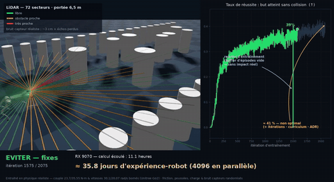
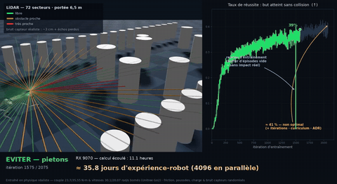
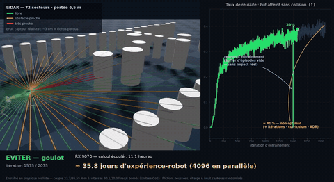

**Apprend** : traverser un **couloir muré** d'obstacles jusqu'à
un but, sans collision : 8 cylindres dont **3 piétons imprévisibles** (cap, fréquence
et amplitude tirés à chaque épisode), plus une **barrière en travers du couloir percée
d'un passage** (~1,3-1,9 m) à position aléatoire — le robot doit trouver et franchir
le goulot. Le couloir est **fermé par deux murs de poteaux** sur toute sa longueur et
**en sortir termine la mission avec la même pénalité qu'une collision** : une première
version sans murs avait appris à *contourner tout le parcours par l'extérieur* — de
l'optimisation de récompense parfaitement rationnelle, mais zéro évitement (voir
*Enseignements*, « le contournement est un reward hack »). En compensation, les
passages internes sont dimensionnés pour rester franchissables (obstacles recentrés,
≥ ~0,85 m entre un obstacle et le mur — le corps du Go2 fait ~30 cm). Les **piétons
vont à une allure de marche** (vitesse de pointe ≈ 2π·f·A bornée à ~0,4–1,4 m/s) et
non au sprint : un premier réglage laissait la fréquence monter jusqu'à des piétons à
**2,6 m/s** (voir *Enseignements*, « la vitesse d'un piéton, c'est 2π·f·A »).
Architecture **à deux couches** :

- **Couche B (apprise)** : une policy de **navigation** lit le scan LiDAR
  (72 secteurs) à 10 Hz et pilote en vitesses (vx, vy, yaw) la policy de
  **locomotion gelée** du marcheur à 50 Hz. Le scan est **bruité comme un vrai
  capteur** (bruit de portée ~3 cm + échos perdus aléatoires) — règle du projet :
  le réalisme ne se négocie pas, même quand il complique l'apprentissage. Une
  v1 sans bruit ni barrière avait validé l'architecture (84 % de réussite en
  ~400 itérations) avant ce ré-entraînement complet.
- **Couche A (déterministe, PAS d'IA)** : arrêt d'urgence réflexe — distance
  frontale minimale du scan, seuil adaptatif à la vitesse (`0,12 + 0,30·v`),
  ralentissement progressif puis interdiction d'avancer. Une garantie « jamais de
  contact » ne peut pas sortir d'un réseau : la couche B propose, la couche A
  dispose. Inactive à l'entraînement (la policy doit apprendre l'évitement sans
  béquille), active à l'inférence et au rendu — comme au déploiement.

La vidéo **montre les rayons** colorés selon la distance (vert = libre, orange,
rouge = danger), et le segment est découpé en **mini-scènes lisibles** (comme pour
les obstacles) : d'abord **obstacles fixes seuls**, puis **piétons mobiles**, puis
le **goulot de la barrière** — même policy dans les trois, seul le décor change
(`lidar_render.py --scenario fixes|pietons|goulot|complet`). Un parcours « tout à
la fois » serait illisible en vidéo. La **légende** rappelle à l'écran le code
couleur des rayons **et** le bruit capteur (« bruit capteur réaliste : ~3 cm +
échos perdus ») — on montre que l'entrée est dégradée, pas idéalisée.

**Finale « traversée complète + arrêt maîtrisé » (23/07).** Les mini-scènes calées
sur la durée d'un checkpoint se **coupaient en pleine traversée** (défaut de cadrage,
pas de politique). Correctif : après la boucle des checkpoints, on rend une **finale**
qui va **jusqu'au but** puis **s'immobilise** (commande de locomotion nulle tenue
~1,8 s, **sans reset** — le robot ne repart pas en arrière). Comme un épisode réussi
téléporterait normalement le robot au départ, la finale fait d'abord une **recherche
de graine** (dry-run sur ~40 graines) pour trouver une traversée qui réussit, puis la
**rejoue** en gravant le scan LiDAR image par image (`_last_scan`) — rendu
**déterministe**, sans hasard de re-simulation. C'est du cadrage/rendu : la policy et
la physique sont inchangées.

**Lecture de la courbe de réussite (deux points annotés à l'écran).**
1. Le **creux vertical à ~itération 1499** n'est **pas** un effondrement de la policy, mais
   un **artefact de reprise d'entraînement** : au redémarrage (`resume_from`), le **buffer
   d'épisodes est vide**, donc le taux de réussite loggé retombe à **0** pendant 1-2 itérations
   puis **récupère aussitôt** (≈0,37 avant, ≈0,37 après) — sans impact réel sur l'apprentissage.
   *(Piège classique du logging TensorBoard sur un run repris, cf. [Enseignements](#enseignements-findings).)*
2. Le taux **plafonne à ~41 %** dans ce scénario **dur** (bruit capteur + piétons imprévisibles
   + goulot) : c'est **honnêtement non optimal**. Le relever passerait par **plus d'itérations**,
   un **curriculum** de difficulté et une **randomisation de domaine automatique (ADR)** — voir
   [Pistes d'exploration](#pistes-dexploration-au-delà-de-ppo-à-récompense-façonnée).

### 7. 🧗 Franchir des obstacles

Une famille de terrain = un entraînement, un GIF :

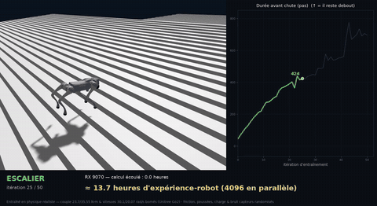
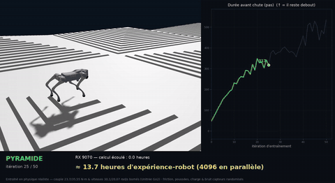
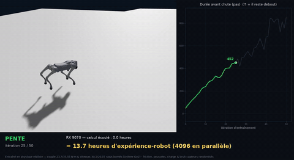
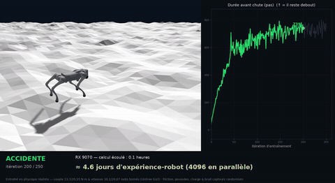
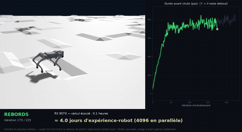
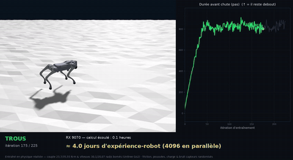
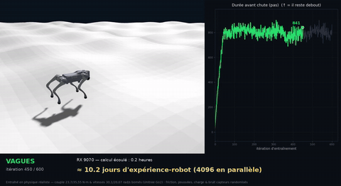

**Apprend** : marcher sur du relief. **Un
entraînement par famille d'obstacle**, chacun son segment vidéo : **pente** (~11°),
**escalier droit** (marches 5 cm), **pyramide à degrés** (5 cm), **sol accidenté**
(±10 cm, type gravier/gravats), **rebords/obstacles discrets** (jusqu'à 10 cm, type
trottoir), **trous** (dalles séparées par des vides de 10 cm, profonds de 25 cm —
nids-de-poule/caillebotis) et **vagues** (houle douce de 12 cm — le sol « roule »).
L'**eau** est volontairement exclue : le solveur utilisé est rigide (un couplage
fluide réaliste est un autre simulateur), et nager n'est pas une capacité du Go2
réel — la simuler serait du spectacle, pas du sim→réel. Pourquoi séparé ? Un
terrain mixte fait échouer le robot « au hasard » selon la case où il apparaît — la
vidéo ne raconte plus une progression mais une loterie. Par famille, chaque courbe
raconte l'apprentissage *de cet obstacle-là*. On entraîne dans **toutes les
directions** (avancer, reculer, pas de côté, tourner) jusqu'à 1,5 m/s + 15 % à
l'arrêt : franchir en marchant, pas en courant (courir sur des marches = chutes,
l'inverse de la priorité stabilité). On récompense **lever franchement les pattes**
(`feet_air_time`), et surtout **rester stable** (tronc à plat) plutôt que « droit et
haut » — sur le relief, la priorité est de ne pas basculer — ainsi que **s'immobiliser
net** même sur une pente (arrêt maîtrisé, pattes figées).

> **Quatre réglages appris à la dure (22/07)** : (1) la pente était initialement à
> **17°**, trop raide pour un marcheur venu du plat → ramenée à **11°** (voir
> *Enseignements*, « warm-start plat → relief ») ; (2) une pénalité de vitesse
> verticale non bornée faisait **diverger** l'entraînement dès qu'un robot culbutait
> sur le relief — il a fallu la borner (voir *Enseignements*, « pénalité non bornée ») ;
> (3) avec la maille heightfield standard de 0,25 m, un « escalier » de marches de
> 7 cm est en réalité **une rampe** — la contremarche est interpolée sur 25 cm de
> course. Maille ramenée à **0,05 m** pour escalier et pyramide : contremarches quasi
> verticales, vraie géométrie, vraie difficulté (voir *Enseignements*, « un heightfield
> ne fait des marches qu'à maille fine ») ; (4) sur ces vraies marches, la pénalité
> **« tronc à plat »** empêchait le robot de se cabrer pour grimper → il tombait ;
> pour escalier/pyramide elle est **relâchée** et le lever de pattes renforcé, marches
> abaissées à **5 cm** (voir *Enseignements*, « la stabilité tronc à plat empêche de
> grimper »).
> Chaque famille suit la règle **pic-puis-dégradation** : on rend le checkpoint du pic
> (ex. pente : `model_2550`, épisode ~850), pas le dernier.

---

## Enseignements (findings)

Notes de terrain, niveau spécialiste — ce que les entraînements nous ont appris :

### Généraux (transverses)

- **Bruit capteurs vs posture (le levier de convergence).** Combiner le bruit capteurs
  au niveau plein *legged_gym* (gyro 0,2 ; encodeur-vitesse 1,5 rad/s) avec des
  récompenses de posture **agressives** (hauteur `base_height` −150) **empêche la
  convergence from-scratch** : plateau à récompense ~5, épisodes ~560/1000 (chutes
  ~44 %). Règle retenue : **on ne réduit jamais le bruit** (il fait partie du réalisme) —
  on **relâche l'exigence de posture droite**. Le pilote marcheur a convergé (récompense
  ~8, épisodes ~870) avec un bruit substantiel et une posture mesurée.
- **La « robustification » à bruit plein d'un marcheur à posture ferme le dégrade.**
  Reprendre le marcheur à bruit plein *en gardant* la posture ferme fait **chuter** les
  épisodes (850 → 519 en 500 itérations). Conclusion : inutile d'ajouter une étape de
  robustification dédiée — les segments **course** et **terrain** (bruit plein + posture
  relâchée *par construction*) robustifient déjà au bruit **en apprenant leur tâche**.
- **Conventions d'angles : à vérifier empiriquement, jamais supposer.** Audit du
  21/07 : dans Genesis, nez relevé = tangage **négatif** — les cibles Euler positives
  des postures (s'asseoir +40°) étaient inversées et auraient
  entraîné un « piqué du nez ». Correction structurelle : les récompenses d'assiette
  visent la **gravité projetée** (`pg_x = −sin θ`), insensible à la convention et
  sans blocage de cardan près de 90°. Coût du test qui a évité l'erreur : 30 s de
  CPU ; coût de l'erreur évitée : ~1,5 h de GPU sur deux entraînements.
- **Audit specs sur l'URDF officiel (21/07).** Les limites du fichier constructeur
  (efforts 23,7/23,7/35,55 N·m ; vitesses 30,1/30,1/20,07 rad/s) correspondent
  exactement aux constantes de `realism.py`, dans le bon ordre articulaire. Ajout à
  cette occasion du **clip des consignes aux débattements URDF** (comportement
  firmware) — opt-in, donc les policies déjà entraînées se rendent à l'identique.
- **⚠️ Une pénalité NON bornée fait diverger PPO (le piège le plus coûteux, 22/07).**
  Le terrain warm-starté depuis le marcheur (entraîné à plat) faisait **culbuter**
  une partie des robots sur le relief → leur vitesse verticale montait à plusieurs
  m/s → la pénalité `lin_vel_z = v_z²` (**non bornée**) explosait (pic de récompense
  moyenne à **−119**) → un pas de gradient PPO catastrophique → la policy
  s'effondrait (épisode figé à ~14 pas, robot couché) et **ne se rétablissait
  jamais** sur des centaines d'itérations. Symptôme identique, plus discret, sur
  l'escalier (pics −24/−44). **Leçon générale** : tout terme de récompense qui peut
  physiquement exploser (vitesse au carré, erreur de hauteur au carré, contact)
  **doit être borné** (`.clip()` + `nan_to_num`) — sinon un état transitoire rare
  suffit à détruire l'entraînement. Le correctif (`clip(max=4.0)`) est invisible en
  locomotion normale (v_z y reste petit) et **ne change rien au réalisme** : c'est du
  *reward shaping*, pas de la physique.
- **Sur-entraînement = pic puis effondrement (exemple chiffré terrain).** Sur la pente
  corrigée : épisode 14 → **~850 au pic (it~2550)** → puis dégradation → **13** (it3177)
  → stagne bas (~70-90 en fin de run). PPO ne s'arrête pas seul et dérive vers un régime
  plus agressif et cassant après le pic. **On sélectionne le checkpoint AU PIC**
  (`model_2550` ici), jamais le final. Corollaire pratique : régler `max_iterations`
  généreux et *choisir* a posteriori vaut mieux que couper trop tôt — chaque checkpoint
  est une policy figée indépendante, la relancer reproduit exactement son comportement (le pic ne « rate »
  pas parce que la suite s'est dégradée).
- **⚠️ Un défaut de la policy de BASE se propage à toute la chaîne (22/07, le plus
  sournois).** Le marcheur pilote — base de *tous* les warm-starts ET locomotion
  gelée du LiDAR — avait été entraîné **sans self-collision** : ses pattes pouvaient
  se traverser, et ses habitudes de « croisement » se transmettaient aux policies
  filles même quand *elles* étaient entraînées avec la collision active (démarche de
  course étrange, pattes qui se frôlent/traversent au rendu LiDAR). Deux leçons :
  (1) auditer en priorité la **policy racine** d'une chaîne de warm-starts — un
  défaut y coûte toute la descendance ; (2) vérifier la config **réellement
  sauvegardée** (`cfgs.pkl`), pas le script actuel — le script d'aujourd'hui ne dit
  pas ce qui tournait hier (et un outil de vérification se teste lui-même : notre
  premier passage lisait une mauvaise clé et concluait à tort que *tout* était sans
  collision).
- **Le pic peut tomber ENTRE deux checkpoints (22/07).** Sur un run warm-starté, le
  pic-puis-effondrement peut être **rapide** : l'escalier culmine vers l'itération 45
  puis s'effondre en moins de 60 itérations. Avec une sauvegarde tous les 100, le vrai
  sommet n'est **jamais enregistré** — on ne dispose que de checkpoints déjà dégradés.
  Correctif : **sauvegarder tous les 25** sur *tous* les entraînements (coût disque
  négligeable, ~4,5 Mo/checkpoint). Corollaire : pour un skill qui pique tôt, faire un
  **run court** (250 iters) plutôt qu'un long qui ne fera que diverger après le pic.
- **Reprendre un run crée un nouveau fichier d'events — le fusionner (22/07).** Le
  sélecteur automatique de « meilleur checkpoint » ne lisait que le **dernier** fichier
  TensorBoard ; or une reprise (`resume_from`) en ouvre un nouveau, sans l'historique.
  Résultat : il croyait le pic à la fin du finetune (checkpoint sur-entraîné) alors que
  le vrai pic était dans le fichier précédent. Il faut **fusionner tous les `events*`**
  du dossier avant de chercher l'argmax. Piège classique : un outil de mesure qui, sur
  un cas particulier (reprise), mesure la mauvaise chose sans erreur visible.
- **La finesse de SAUVEGARDE ≠ la densité d'AFFICHAGE (méthode vidéo).** Sauver
  finement (tous les 25, pour le pic) ne doit pas gonfler la vidéo. Le rendu
  échantillonne un nombre fixe de checkpoints selon des **fractions front-loaded** de
  la plage (denses au début où l'apprentissage se joue, espacés ensuite), indépendantes
  du `save_interval` et de la longueur du run. Deux préoccupations distinctes — *ne pas
  rater le pic* (sauvegarde) et *raconter l'apprentissage lisiblement* (affichage) —
  découplées proprement.

### 🏃 Courir

- **Course = stabilité, pas posture droite.** Exiger une station haute et droite pendant
  le galop est contre-productif (le galop doit s'abaisser) : PPO « refuse alors de
  courir ». On garde la **stabilité** (tronc à plat, ne pas tomber) et on relâche la
  posture. Même principe sur le terrain.
- **La vitesse est bornée par la *physique*, pas par un idéal.** Avec les couples et
  vitesses articulaires bornés aux specs Unitree, la récompense de course devient
  volatile près de la vitesse max : le robot converge vers « aussi vite que les vrais
  moteurs le permettent » — exactement le comportement qu'on veut montrer.
- **Vitesse de course : la stabilité prime, on ne force pas la spec labo.** Viser les
  ~5 m/s annoncés (test labo Unitree) sous nos couples bornés fait **chuter** la
  stabilité (épisode 940 → 250, chutes fréquentes). On retient **2,7 m/s** : la vitesse
  où le robot court vite ET tient (~940 pas sans tomber). La spec constructeur est un
  plafond théorique, pas une cible d'entraînement quand la contrainte est la stabilité.
- **Entraîner la TRANSITION, pas seulement le régime (22/07).** Une policy peut
  exceller en régime établi (courir à 2,7 m/s) et **échouer sur la transition** vers un
  autre régime (s'arrêter) si celle-ci est sous-représentée à l'entraînement : coupure
  brutale → salto. Le régime cible ne suffit pas ; il faut exposer la policy aux
  **basculements** eux-mêmes (ici : fraction accrue d'essais à commande nulle qui
  surviennent *pendant* le sprint).

### 🛌🧎🐕‍🦺 Postures (se coucher / se relever / s'asseoir)

- **Poser le mouvement dans la récompense : le frein bat la chorégraphie (22/07,
  deux échecs successifs).** Récompenser « être couché » (cible statique) fait
  plonger le robot **d'un coup** — la policy maximise la fraction d'épisode dans la
  posture finale. Première tentative de correctif : transformer la cible en
  **trajectoire temporelle** type firmware (descente scriptée en étapes, en avance =
  pénalisé comme en retard). Résultat : **pas apprenable** — au départ, « debout »
  est exactement conforme au début de la trajectoire, donc aucun gradient n'amorce
  jamais la descente, et PPO reste coincé debout (l'obs 45-D n'a d'ailleurs pas
  d'horloge : suivre un chrono qu'on ne perçoit pas est structurellement fragile).
  Solution retenue, plus simple et robuste : **cible statique** (qui descend à coup
  sûr) **+ forte pénalité de vitesse verticale du corps** — le *où aller* reste
  trivial à apprendre, le *comment* (lentement) est imposé par un frein, pas par une
  chorégraphie. Nuance pour le relevé : l'immobilité finale se gate sur l'**état
  mesuré** (debout), pas sur le temps — on ne sait pas d'avance combien dure un
  relevé depuis le dos.
- **L'assise ne s'assoit jamais = récompense sans gradient, PAS une limite fabricant
  (22/07).** Le robot restait **debout** tout du long. Fausse piste tentante : « c'est
  peut-être bloqué par les limites articulaires du Go2 ». Réfutation dans la vidéo
  elle-même : si une butée mécanique bloquait, le robot **essaierait** et se figerait en
  assise **partielle** (consignes clampées au firmware) ; or il reste debout **sans jamais
  amorcer le geste**. Il n'essaie pas → rien ne l'y incite. Cause réelle : `sit_pitch`
  récompensait le cabrage par une gaussienne **trop étroite** (σ=0,25) sur la gravité
  projetée — depuis debout (erreur ≈0,64) elle vaut ~0,001, **plate** : se cabrer un peu ne
  rapporte quasi rien, donc **aucun gradient pour DÉMARRER** (même piège que le coucher
  phasé, cf. plus haut). Et `rear_low` (−30) était ~2,7× plus faible que la pénalité de
  hauteur du coucher (−80) → n'abaissait pas assez. Correctif : élargir la gaussienne
  (σ=0,6 → gradient dès le premier degré de cabrage) et renforcer l'abaissement (−55), **sans
  toucher à la physique ni aux limites** : `apply_realism` reste actif (couple 23,7/35,55 N·m,
  vitesse 30,1/20,07 rad/s, `clamp_targets_to_limits`). **Principe non négociable** : une
  posture qui échoue se corrige par le **modelage de la récompense** (créer un gradient), JAMAIS
  en desserrant une contrainte physique ou constructeur — une récompense ne peut de toute façon
  pas contourner les limites (elle fait *vouloir* le geste ; le plancher dur reste). Le vrai Go2
  s'assoit dans ses limites, donc le geste est atteignable honnêtement.
- **Une gaussienne trop LARGE plafonne à mi-geste (assise, 23/07).** Élargir la gaussienne de
  cabrage (σ 0,25 → 0,6) avait réglé le non-démarrage — mais introduit le défaut inverse : le
  robot **s'étalait à mi-cabrage** (avant bas) au lieu de s'asseoir franchement. Cause : une
  gaussienne large rend le **demi-geste déjà très payant** — à ~20° de nez levé elle vaut déjà
  ~0,78, et aller jusqu'à 40° (vrai assis) ne rapporte que ~0,2 de plus, insuffisant pour
  justifier l'effort et l'instabilité → optimum local à mi-chemin. La largeur qui *aide au
  démarrage* **nuit à l'aboutissement** : un même paramètre ne peut pas régler les deux bouts du
  geste. Correctif : une récompense **coarse+fine** — somme de deux gaussiennes, une **large**
  (σ=0,6) qui garde le gradient d'amorçage depuis debout, une **étroite** (σ=0,18) qui récompense
  fortement le geste *complet* (partiel→complet passe de ~0,35 à 1,0 au lieu de +0,2) — plus un
  poids relevé (6→9) pour dominer. Leçon générale : quand une même récompense doit à la fois
  **amorcer** un geste depuis loin **et** en exiger l'**aboutissement précis**, une seule échelle
  ne suffit pas ; superposer une échelle grossière (exploration) et une échelle fine (exploitation)
  découple les deux — sans toucher à la physique (pur *reward shaping*, `apply_realism` intact).
- **Une posture correcte plafonne si rien ne contraint les APPUIS (assise v3, 23/07).** La
  *coarse+fine* réglait bien l'assiette (nez-haut) et la hauteur d'arrière-train — récompense
  ~48 — mais le robot les atteignait en **étalant une paire de pattes** : un assis penché, pas
  droit. Cause : la récompense décrivait *l'orientation du tronc* et *la hauteur*, jamais **où se
  posent les pieds** → l'espace des solutions incluait la variante avachie, aussi payante. Leçon :
  spécifier une posture par ses seuls angles/hauteurs sous-détermine le geste ; il faut aussi
  **contraindre les points d'appui** (terme borné [0,1], même échelle que `sit_pitch`, pur
  *reward shaping* — `get_links_pos()` **lit** la position post-contact, la physique ne bouge pas).
- **⚠️ Vérifier QUELLE partie du corps échoue AVANT de façonner (assise v3→v4, 23/07 —
  retour d'expérience).** Premier correctif d'appui (`front_tuck`) ciblé sur les **pieds
  AVANT** → **quasi aucun effet** (v3 ≈ v2). En **zoomant** sur une image du rendu, le vrai
  défaut est apparu : ce n'était **pas** l'avant (à peu près correct) mais l'**ARRIÈRE** — les
  pattes arrière **s'étendent vers l'avant** au lieu de se replier sous la croupe. J'avais
  façonné la **mauvaise paire de pattes**. Leçon : un diagnostic « à l'œil » sur une vue
  d'ensemble est trompeur ; **identifier précisément le segment fautif (zoom, repérage
  avant/arrière) avant de dépenser un cycle GPU** — un terme de récompense parfaitement écrit
  sur la mauvaise cible ne corrige rien. Correctif v4 `rear_tuck` sur les pieds arrière.
- **La bonne MÉTRIQUE dépend du segment (assise v4, 23/07).** Pour les pieds **avant**,
  « rangés » = *faible distance au CENTRE du corps* (`front_tuck`). Pour les pieds **arrière**,
  cette même métrique **échoue** : un pied arrière qui s'étale vers l'avant se **rapproche** du
  centre → la distance au centre le récompenserait à tort. Il faut mesurer la distance pied
  arrière ↔ **son attache de hanche** (lien `*_thigh`) : replié = pied sous la hanche (petite
  distance), étendu devant = grande distance. Leçon : une métrique de « rangement » n'est pas
  transposable telle quelle d'un membre à l'autre — vérifier qu'elle **discrimine bien** le bon
  et le mauvais cas pour CE membre (ici le signe du défaut s'inverse entre avant et arrière).
- **Un « rebond » au relevé n'est pas une entorse aux limites moteur — c'est du CONTACT
  (22/07).** Retour vidéo : le robot semble « rebondir sur le sol » en se relevant. Les
  limites **actionneur** (couple/vitesse/position) sont pourtant scrupuleusement enforce
  (`apply_realism` actif à l'entraînement getup) — elles n'ont rien à voir avec un rebond.
  Un rebond relève de la **dynamique de contact** : aucune restitution n'est configurée
  (contact quasi-inélastique par défaut), mais une remontée trop **vigoureuse** produit des
  **pics de vitesse verticale** qui font claquer/rebondir le corps. Correctif *par la
  récompense*, sans toucher la physique : un terme `vertical_settle` (−0,6) pénalise `v_z²`
  de la base. L'asymétrie est la clé — un relevé fluide a `v_z`≈0,3 m/s (`v_z²`≈0,1, coût
  quasi nul) tandis qu'un rebond a des pics >1 m/s (`v_z²`>1, coût élevé) : le terme cible
  les impacts brusques **sans** freiner la remontée nécessaire. Si un rebond résiduel
  persistait, il serait d'origine **pas-de-temps** (substeps=2) et se traiterait en
  raffinant le contact — jamais en desserrant une limite constructeur.

### 📡 LiDAR

- **Le contournement est un reward hack d'évitement (22/07).** Sans murs, la policy
  LiDAR apprenait à **faire le tour du parcours par l'extérieur** : progression vers le
  but maximale, proximité minimale — récompense optimale, zéro évitement. C'est le
  comportement *rationnel* pour la récompense donnée, pas un bug d'apprentissage.
  Correctif structurel : **fermer le monde** (couloir muré infranchissable, vu au
  LiDAR) et faire de la sortie une terminaison pénalisée, tout en **élargissant les
  passages intérieurs** pour que la stratégie honnête reste faisable. Généralisable :
  si une échappatoire existe, PPO la trouvera — la supprimer physiquement vaut mieux
  que la pénaliser finement.
- **La vitesse d'un piéton, c'est 2π·f·A (22/07).** Les piétons du parcours LiDAR
  oscillent latéralement (amplitude A, fréquence f) : leur vitesse de **pointe** vaut
  `2π·f·A`, pas `f` ni `A` isolément. Un tirage « raisonnable » vu terme à terme
  (f jusqu'à 0,35 Hz, A jusqu'à 1,2 m) produisait en réalité des piétons à **2,6 m/s**
  — un sprint, pas une marche, irréaliste et injustement difficile à éviter. On borne
  désormais le **produit** pour rester à ~0,4–1,4 m/s (allure humaine). Leçon : borner
  la grandeur *physiquement observée* (la vitesse), pas ses facteurs pris séparément.

### 🧗 Franchir des obstacles (terrain)

- **Warm-start plat → relief : adoucir la marche d'entrée.** Une pente à 17° (30 %)
  est trop raide d'emblée pour un marcheur qui ne connaît que le plat : même sans la
  divergence ci-dessus, il n'a aucune base pour s'y tenir. Ramenée à **11°**, il s'y
  adapte progressivement. Généralisable : la difficulté d'un terrain doit rester à
  portée de la compétence de départ, sinon le warm-start ne sert à rien.
- **Un heightfield ne fait des marches qu'à maille fine (22/07).** La revue vidéo a
  révélé que « l'escalier » entraîné était en réalité **une rampe** : à maille
  horizontale de 0,25 m, une contremarche de 7 cm est interpolée sur 25 cm de course
  (~16° de pente locale). Le rendu ET la physique étaient faux — le robot n'a jamais
  rencontré de marche verticale. Maille ramenée à **0,05 m** (contremarche sur 5 cm,
  ~54°) pour escalier et pyramide : la géométrie est vérifiée **visuellement sur une
  image CPU avant tout GPU** (30 s qui évitent des heures). Leçon générale : sur un
  heightfield, toute arête « verticale » a une pente réelle de `hauteur/maille` —
  vérifier l'image, pas les paramètres.
- **La stabilité « tronc à plat » empêche de grimper un escalier (22/07).** La règle
  générale du relief — *récompenser un tronc à plat pour ne pas basculer* — se
  **retourne** sur des marches : pour poser une patte sur la contremarche du dessus,
  le robot doit **cabrer l'avant** (tangage nez en l'air). Une pénalité d'orientation
  forte (−3,5) combat exactement ce geste → le robot bute et tombe au pied de
  l'escalier. Correctif spécifique aux marches : orientation **relâchée à −0,8**
  (tangage libre), `feet_air_time` renforcé (lever franc pour poser sur la marche),
  contacts d'arêtes tolérés, marches abaissées 7 → **5 cm**. Leçon : une contrainte de
  posture juste « en moyenne » peut interdire *le* geste clé d'un sous-cas — auditer
  par type de terrain, pas globalement.
- **Un défaut de RENDU n'est pas un défaut de POLICY — diagnostiquer avant de
  ré-entraîner (22/07).** Sur l'escalier, le robot faisait un « salto » à l'arrêt. Premier
  réflexe : finetuner l'arrêt. Mauvais réflexe. La vraie cause : le terrain est une grille
  de tuiles de 9 m dont **chaque escalier monte indépendamment** → il y a une **falaise**
  (~1 m) à la jonction entre deux tuiles. Au **rendu** (un seul environnement), le respawn
  tirait une tuile et une position **aléatoires** — parfois près d'un bord — et trois
  secondes de montée faisaient **franchir la falaise** : le robot marchait dans le vide et
  basculait. Point capital : la policy de locomotion est **aveugle** (proprioception seule,
  aucun scan du relief) — elle ne *peut pas* éviter un bord invisible, donc **aucun
  entraînement ne réglerait ça**. Le correctif est côté rendu, à coût GPU nul : un **spawn
  déterministe au centre d'une tuile** (`place_on_terrain_center` dans `pilot_walk_video.py`),
  la montée restant loin des bords. La pyramide, elle, n'avait pas le bug : ses marches
  montent vers l'**apex central**, donc le robot grimpe *en s'éloignant* des bords. Leçon :
  face à un comportement aberrant en vidéo, distinguer *ce que la policy a appris* de *ce que
  la mise en scène lui impose* — ici, l'utilisateur a rectifié un premier diagnostic erroné,
  et le vrai correctif a économisé un finetune inutile.

---

## Structure du dépôt

```
install.sh            # installe TOUT (conteneur distrobox ROCm + venv + Genesis) — 1 commande
uninstall.sh          # supprime proprement conteneur + venv (garde code, logs, vidéos)
go2_train.py          # entraînement PPO from-scratch (marche droite, robot nu)
go2_env.py            # environnement Genesis (12 DOF, récompenses + moteur/DR réalistes)
realism.py            # RÉALISME sim->réel centralisé (specs Unitree + randomisation) — obligatoire
go2_run_train.py      # COURIR : curriculum de vitesse → limite constructeur (stabilité > posture)
go2_terrain_env.py    # env TOUT-TERRAIN : heightfield, spawn en relief, hauteur de base relative
go2_terrain_train.py  # FRANCHIR : 7 familles d'obstacles séparées (--family pente|escalier|…)
go2_lidar_env.py      # LIDAR : nav hiérarchique (scan 72 secteurs → vx,vy,yaw), couloir muré
go2_lidar_train.py    # LIDAR : entraînement de la policy de navigation
go2_getup_env.py      # SE RELEVER : départ couché orientation aléatoire, immobilité gated état
go2_getup_train.py
go2_liedown_train.py  # SE COUCHER : cible basse + frein de vitesse verticale (descente lente)
go2_sit_env.py        # S'ASSEOIR : assiette par gravité projetée + frein de vitesse
go2_sit_train.py
pilot_walk_video.py   # rendu vidéo composite : robot + courbe d'apprentissage + overlay temps
lidar_render.py       # rendu LiDAR : rayons debug colorés par distance
_peakcap.py           # sélecteur du checkpoint AU PIC (fusionne les events TensorBoard)
LICENSE               # licence MIT
gifs/                 # aperçus GIF (un par compétence) — versionnés
logs/                 # checkpoints + journaux TensorBoard   (ignoré par git)
videos/               # rendus haute résolution              (ignoré par git)
```

---

## Installer la simulation (guide débutant — 1 commande)

Tout tourne dans un **conteneur [distrobox](https://github.com/89luca89/distrobox)** :
un « Linux dans ton Linux » qui embarque toute la pile GPU (ROCm + PyTorch déjà
compilés par AMD) **sans rien modifier sur ton système**. Tu peux tout supprimer
proprement à la fin. Testé sur : **RX 9070**, image
`rocm/pytorch:rocm7.2.4` (Ubuntu 24.04, Python 3.12, PyTorch 2.10),
**Genesis 1.2.2**, **rsl-rl-lib 5.4.2**.

### Prérequis (une fois)

Un Linux avec `distrobox` et `podman` (ou docker) :

```bash
# Fedora
sudo dnf install distrobox podman
# Debian / Ubuntu
sudo apt install distrobox podman
# Arch
sudo pacman -S distrobox podman
```

Pour un GPU AMD, ton utilisateur doit accéder au GPU :
`sudo usermod -aG video,render $USER` (puis déconnecte/reconnecte ta session).

### Installation automatique

```bash
git clone <url-du-depot> go2-rl && cd go2-rl
./install.sh
```

Le script : crée le conteneur `genesis-box` depuis l'image officielle AMD (~15 Go
au premier téléchargement — patience), crée le venv `~/venvs/genesis` qui **hérite
du PyTorch ROCm de l'image** (aucune compilation, aucun wheel exotique), installe
Genesis + les dépendances (versions épinglées), puis vérifie que le GPU est visible.

Variantes : `BOX_NAME`, `BOX_IMAGE`, `VENV_DIR` en variables d'environnement.
**GPU NVIDIA** : remplace l'image par une image CUDA+PyTorch et suis les mêmes
étapes (`BOX_IMAGE=... ./install.sh` — le script détecte où vit le PyTorch de
l'image, `/opt/venv` ou python système, et le venv en hérite ; non testé côté
NVIDIA, retours bienvenus). **Sans GPU** : non testé — les scripts d'entraînement sélectionnent le backend
GPU (seul `go2_lidar_train.py` propose un flag `--cpu`, utilisable pour de petits essais
avec `-B 256`).

### Désinstallation

```bash
./uninstall.sh     # supprime venv + conteneur (+ image si tu confirmes)
```

Ton code, `logs/` (checkpoints) et `videos/` (rendus) sont conservés.

---

## Utilisation

Toujours **entrer dans le conteneur** d'abord, puis activer le venv :

```bash
distrobox enter genesis-box
source ~/venvs/genesis/bin/activate
cd <dossier-du-projet>

# 1) Entraîner la marche de zéro (checkpoints tous les 25 iters dans logs/go2-walking)
python go2_train.py -e go2-walking -B 4096 --max_iterations 2500

# 2) Suivre l'apprentissage en direct (autre terminal, même conteneur)
tensorboard --logdir logs

# 3) Rendre la vidéo composite robot + courbe + overlay temps (APRÈS l'entraînement)
python pilot_walk_video.py -e go2-walking

# Autres compétences : go2_run_train.py (course), go2_terrain_train.py --family pente,
# go2_getup_train.py, go2_liedown_train.py, go2_sit_train.py,
# go2_lidar_train.py — puis lidar_render.py pour le rendu avec rayons.
```

> ⚠️ Rappel ROCm : **jamais** de rendu/éval Genesis pendant qu'un entraînement GPU
> tourne (crash constaté) — toujours l'un APRÈS l'autre.

---

## Pistes d'exploration (au-delà de PPO à récompense façonnée)

Ce projet est du **PPO à récompense façonnée à la main**, une compétence *nommée* à la fois,
avec réalisme maximal. Plusieurs directions l'étendraient — classées ici par **alignement avec
l'objectif du projet** (sim→réel, à terme un déploiement sur Go2 EDU physique). L'écosystème
Genesis étant jeune, la plupart de ces recettes ont été publiées sur **Isaac Gym / Isaac Lab**
et demandent d'être reportées.

**Fortement alignées (généralisation + sim→réel) :**

- **Curriculum de terrain automatique.** Aujourd'hui une famille de terrain = un entraînement
  séparé (choix pédagogique : une courbe lisible par obstacle). Pour un franchisseur *généraliste*,
  reprendre le schéma **legged_gym** : la grille de sous-terrains (`gs.morphs.Terrain`,
  `n_subterrains`) devient une **matrice de difficulté** (ligne = niveau, colonne = type), chaque
  env porte un `terrain_level`, promu quand il franchit / rétrogradé quand il stagne. Détail qui
  compte : au niveau max, **renvoyer l'env à un niveau aléatoire** (sinon la population se tasse sur
  le dernier niveau et la diversité s'effondre). Cran au-dessus : **PLR / ACCEL** — échantillonner
  et muter les heightfields en maximisant le *regret* (erreur TD), pour un générateur de difficulté
  **sans plafond**.
- **Randomisation de domaine automatique (ADR).** Notre randomisation est à plages *fixes*
  (`realism.py`). L'ADR **élargit chaque plage** (friction, masse ±, CoM, gains PD, retard
  d'actionneur, bruit d'obs) dès que la performance dépasse un seuil — le domaine s'ouvre aussi
  loin que la policy le supporte. **Piège connu** : ne PAS randomiser dès l'itération 0 (la marche
  de base ne peut pas émerger) — entraîner 500–1000 itérations propres, *puis* ouvrir. C'est la
  suite naturelle de notre exigence sim→réel.

**Utile surtout pour des runs très longs / ouverts :**

- **Perte de plasticité.** Sur une boucle censée tourner des jours, un réseau *fige* sa capacité
  d'apprendre. Contre-mesures à câbler tôt : **ReDo** (réinitialiser périodiquement les neurones
  quasi-inactifs), **LayerNorm** acteur+critique, **régularisation L2 vers les poids d'init**
  (pas vers zéro). Sans ça un long run plafonne et on accuse à tort le curriculum.

**Pivot de recherche (s'éloigne du récit « compétences nommées ») :**

- **Découverte de compétences non supervisée.** Retirer la récompense de tâche et laisser des
  comportements *émerger* : **DIAYN** (récompense intrinsèque `log q(z|s)`), **METRA** (nettement
  meilleur que DIAYN en locomotion — DIAYN tend à trouver « 16 façons de rester debout »), ou le
  plus simple **RND** en bonus d'exploration par-dessus le PPO existant (~30 lignes). Intéressant
  scientifiquement, mais c'est un *autre* projet que « montrer un robot apprendre des gestes
  identifiables » — à considérer comme une branche, pas une évolution.

**Bases de départ alternatives.** L'exemple Go2 officiel de Genesis est **volontairement
minimaliste** (sol plat, pas de curriculum, pas de DR, récompenses simplifiées) — d'où le fait
qu'ici terrain, curriculum et randomisation ont été **construits à la main**. Pour ne pas
réécrire l'infra, **`lupinjia/genesis_lr`** (portage legged_gym → Genesis : terrains, CTS
teacher-student, AMP, DeepMimic déjà branchés) est une base plus lourde mais complète. Dans tous
les cas : **épingler les versions** (`genesis-world`, `rsl_rl` — l'API a bougé entre 0.2 et 1.0).

> **Avis (pour ce projet précisément).** Les deux briques à plus fort retour sont le **curriculum
> de terrain** et l'**ADR** : elles servent directement la généralisation et le transfert vers le
> vrai Go2 EDU, dans la continuité de la philosophie sim→réel. La découverte de compétences est un
> beau sujet de recherche mais réoriente le propos. Conseil pratique : si l'on se retrouve à passer
> plus de deux jours sur de la *plomberie* Genesis plutôt que sur l'algo, prototyper la logique de
> curriculum sur Isaac Lab (où elle est fournie), puis la reporter.

---

## Licence

**MIT** — voir le fichier [`LICENSE`](LICENSE). Réutilisation libre, y compris commerciale,
avec conservation de la mention de licence.
